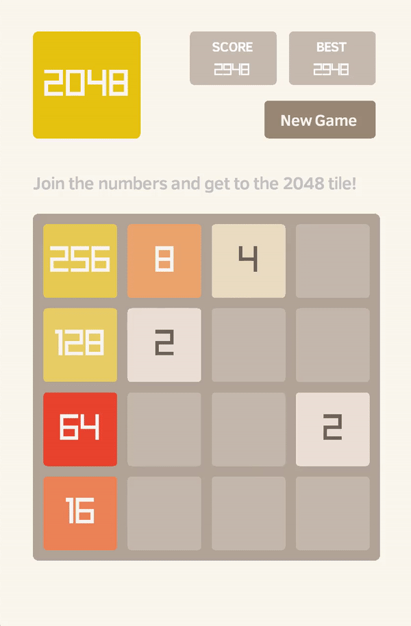

# 2048

A small clone of [2048](https://github.com/gabrielecirulli/2048) written on [raylib](https://github.com/raysan5/raylib)

### Definition of the game

The board on which 2048 is played is a 4 by 4 grid of tiles. Tiles can either be empty, or contain
an integer number that is a power of two. The initial board contains two random tiles in random
positions. Each of these tiles has a 90% probability of being a 2, and a 10% probability of being
a 4.

At any time, the player has the option to slide all of the tiles in the grid in one of four
directions: up, down, left or right. The tiles slide naturally as expected, filling empty tiles
with tiles that contain numbers, but also have an additional behaviour. If there are two adjacent
non-empty tiles (in the direction of the slide) that hold the same value, then those two tiles
merge together, forming a new tile whose value is the sum of the original two. The new tile’s value
is added to the score. If there are more than two adjacent non-empty tiles holding the same value,
this pairing is prioritised to be between those most in the direction specified — so sliding a grid
with a row [2,2,2,8] to the left would result in [4,2,8,0], whereas sliding it to the right would
result in [0,2,4,8].

After each slide, a new random tile (again being a 2 with 90% probability, and being a 4 with 10%
probability) is placed in one of the remaining empty tile positions.

The game ends in one of two ways. If one of the tiles in the grid has the value 2048, then the
game is won. If the grid is full of tiles, and no slides in any direction will alter the grid any
further, then the game is lost. The win condition holds precedence over the loss condition.

## Platforms

* Mac OS X
* Windows

## Documentation

* [Development guidelines](http://scrambledeggsontoast.github.io/2014/05/09/writing-2048-elm/)
* [Raylib](https://github.com/raysan5/raylib/wiki)

## Contributing

**2048-raylib** is an open source project and contributions are welcome! Check out the
[Issues](https://github.com/dmvass/2048-raylib/issues) page to see if your idea for a contribution
has already been mentioned, and feel free to raise an issue or submit a pull request.

## License

This code is distributed under the terms of the MIT license.
